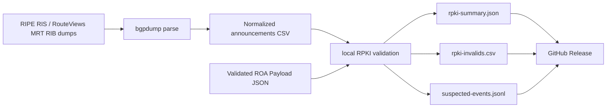

# RouteSentinel

Daily route-security snapshots from public BGP RIB dumps and validated RPKI VRPs.

RouteSentinel builds an auditable dataset for RPKI coverage, RPKI-invalid route
announcements, and conservative origin-anomaly signals. It is designed as a batch
pipeline: no internet scanning, no per-prefix API fan-out, and no dependency on a live
stream for the v1 dataset.

The default dataset is deduplicated to one observation per `(prefix, origin ASN, collector)`.
This keeps daily releases focused on route-origin state instead of peer-level duplicate
visibility rows.

## Latest Snapshot

<!-- routesentinel-stats:start -->
Last successful snapshot: **2026-05-23**
Release assets: [2026-05-23](https://github.com/ipanalytics/RouteSentinel/releases/tag/2026-05-23)
Release updated: **2026-05-23 14:12 UTC**

| Metric | Value |
| --- | ---: |
| Total announcements | 1,393,739 |
| RPKI valid | 906,764 |
| RPKI invalid | 2,250 |
| RPKI not-found | 484,725 |
| RPKI coverage ratio | 65.06% |

_This block is updated after the GitHub Release is successfully published._
<!-- routesentinel-stats:end -->

## What It Produces

- `rpki-summary.json`: aggregate counts and RPKI coverage ratio.
- `rpki-invalids.csv`: announcements covered by ROAs but originated by an unexpected ASN.
- `suspected-events.jsonl`: conservative event signals such as `rpki-invalid`,
  `multi-origin`, and `multi-origin-invalid`.
- Daily GitHub Release assets tagged by date.

## How It Works



RouteSentinel compares each BGP announcement against a local VRP table:

- `valid`: a covering VRP exists and the origin ASN matches.
- `invalid`: a covering VRP exists, but the origin ASN does not match.
- `not-found`: no covering VRP exists.

## Data Sources

RouteSentinel expects two source types:

- BGP RIB dumps in MRT format, for example RIPE RIS or RouteViews snapshots.
- Validated ROA Payload JSON, produced by an RPKI validator or a trusted public VRP feed.

The project does not perform RPKI cryptographic validation itself in v1. It consumes
already validated VRPs and performs local route-origin validation against them.

## Install

Requirements:

- Python 3.11+
- `bgpdump` for MRT parsing when using `routesentinel parse-mrt`

Install for local development:

```bash
python -m pip install -e ".[dev]"
```

Run tests:

```bash
python -m pytest
```

## Usage

Build a snapshot from normalized announcements and a VRP JSON file:

```bash
routesentinel snapshot \
  --announcements data/normalized/rrc00.csv \
  --vrps data/raw/vrps.json \
  --out out
```

Normalized announcements CSV:

```csv
prefix,origin_asn,as_path,peer,collector
203.0.113.0/24,64496,64497 64496,192.0.2.1,rrc00
```

VRP JSON:

```json
{
  "roas": [
    {
      "prefix": "203.0.113.0/24",
      "maxLength": 24,
      "asn": "AS64496"
    }
  ]
}
```

Download source files with a responsible User-Agent:

```bash
routesentinel fetch \
  https://data.ris.ripe.net/rrc00/latest-bview.gz \
  data/raw/rrc00-latest-bview.gz
```

Convert an MRT dump to normalized CSV:

```bash
routesentinel parse-mrt \
  data/raw/rrc00-latest-bview.gz \
  data/normalized/rrc00.csv \
  --collector rrc00
```

`parse-mrt` deduplicates by `(prefix, origin ASN, collector)` by default. Use
`--no-dedupe` only when you explicitly need peer-level visibility rows.

## Daily Releases

The included workflow at `.github/workflows/release.yml` runs daily at `06:00 UTC` and:

1. Installs Python and `bgpdump`.
2. Downloads one RIPE RIS RIB dump and one public VRP JSON file.
3. Normalizes MRT announcements to CSV.
4. Builds summary, invalids, and suspected-event outputs.
5. Publishes the files as GitHub Release assets tagged by date.

For broader visibility, add more collectors and merge their normalized CSV outputs before
running `routesentinel snapshot`.

Long-running CLI commands print progress to stderr. In GitHub Actions logs you will see
messages such as:

```text
[routesentinel] download progress 250.0 MiB / 800.0 MiB (31.2%)
[routesentinel] parse progress bgpdump_lines=1000000 raw_announcements=999999 unique_announcements=120000 duplicates_skipped=879999
[routesentinel] validate progress rows_seen=1000000 unique_announcements=120000 duplicates_skipped=880000
```

## Output Schemas

`rpki-summary.json`:

```json
{
  "coverage_ratio": 0.5,
  "invalid": 1,
  "not_found": 0,
  "total_announcements": 2,
  "valid": 1
}
```

`rpki-invalids.csv`:

```csv
prefix,origin_asn,status,expected_origins,collector,peer
198.51.100.0/24,64499,invalid,64500,rrc00,192.0.2.2
```

`suspected-events.jsonl`:

```jsonl
{"confidence":"medium","prefix":"198.51.100.0/24","seen_origins":[64499],"signal":"rpki-invalid"}
```

## Design Principles

- Batch-first: daily snapshots before realtime stream processing.
- Source-aware: every event keeps collector and peer context where available.
- Conservative labels: the dataset reports signals, not definitive hijack claims.
- Operator-friendly: outputs are small, stable, and suitable for GitHub Releases.

## Limitations

- v1 does not implement route-leak valley-free validation.
- v1 does not ingest RIS Live or Kafka update streams.
- Multi-origin prefixes can be legitimate, especially with anycast and complex
  traffic-engineering setups.
- Accuracy depends on collector visibility and the freshness of the selected VRP feed.

## License

MIT. See [LICENSE](LICENSE).
