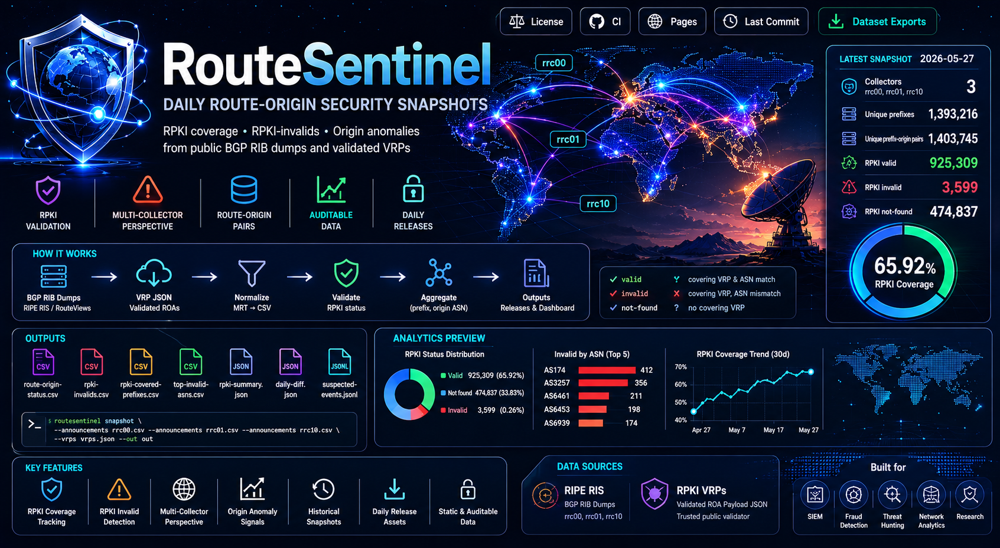
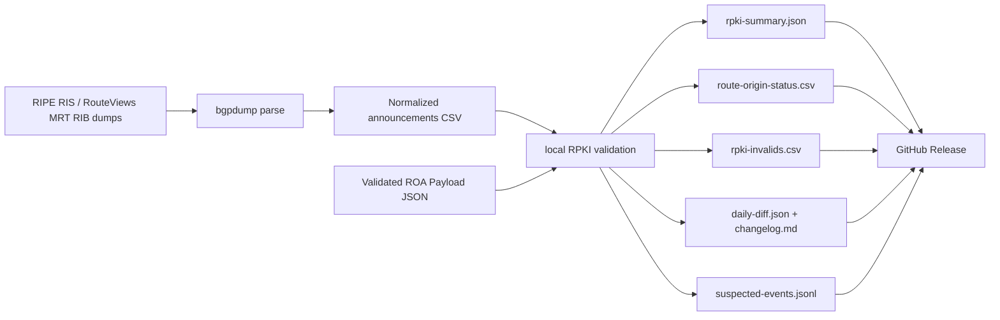

# RouteSentinel

Daily route-origin security snapshots from public BGP RIB dumps and validated RPKI VRPs.

RouteSentinel builds an auditable dataset for RPKI coverage, RPKI-invalid route
announcements, and conservative origin-anomaly signals. It is designed as a batch
pipeline: no internet scanning, no per-prefix API fan-out, and no dependency on a live
stream for the v1 dataset.

<p align="center">
  
</p>

The default dataset is deduplicated to unique `(prefix, origin ASN)` route-origin pairs
and records which collectors saw each pair. This keeps daily releases focused on route-origin
state instead of peer-level duplicate visibility rows.

## Latest Snapshot

<!-- routesentinel-stats:start -->
Last successful snapshot: **2026-05-27**
Release assets: [2026-05-27](https://github.com/ipanalytics/RouteSentinel/releases/tag/2026-05-27)
Release updated: **2026-05-27 09:51 UTC**

| Metric | Value |
| --- | ---: |
| Collectors | rrc00, rrc01, rrc10 |
| Unique prefixes | 1,393,216 |
| Unique prefix-origin pairs | 1,403,745 |
| RPKI valid | 925,309 |
| RPKI invalid | 3,599 |
| Unique invalid prefixes | 3,583 |
| RPKI not-found | 474,837 |
| RPKI coverage ratio | 65.92% |

_This block is updated after the GitHub Release is successfully published._
<!-- routesentinel-stats:end -->

## What It Produces

- `rpki-summary.json`: aggregate counts and RPKI coverage ratio.
- `route-origin-status.csv`: normalized status for every unique prefix-origin pair.
- `rpki-invalids.csv`: prefix-origin pairs covered by ROAs but originated by an unexpected ASN.
- `rpki-covered-prefixes.csv`: prefixes with at least one covering ROA.
- `top-invalid-asns.csv`: ASNs ranked by invalid prefix-origin pair count.
- `daily-diff.json`: machine-readable diff against the previous release, when available.
- `changelog.md`: human-readable daily diff and snapshot summary.
- `suspected-events.jsonl`: conservative event signals such as `rpki-invalid`,
  `multi-origin`, and `multi-origin-invalid`.
- Daily GitHub Release assets tagged by date.

## How It Works



RouteSentinel compares each BGP announcement against a local VRP table:

- `valid`: a covering VRP exists and the origin ASN matches.
- `invalid`: a covering VRP exists, but the origin ASN does not match.
- `not-found`: no covering VRP exists.

## Data Sources

RouteSentinel expects two source types:

- BGP RIB dumps in MRT format, for example RIPE RIS or RouteViews snapshots.
- Validated ROA Payload JSON, produced by an RPKI validator or a trusted public VRP feed.

The included daily workflow uses a multi-collector RIPE RIS perspective: `rrc00`, `rrc01`,
and `rrc10`. This is broader than a single collector, but still a collector-based view of
the routing system. To expand toward a more global view, add RouteViews collectors such as
`route-views2` and `route-views6` to the workflow and pass their normalized CSV files to
`routesentinel snapshot`.

The project does not perform RPKI cryptographic validation itself in v1. It consumes
already validated VRPs and performs local route-origin validation against them.

## Install

Requirements:

- Python 3.11+
- `bgpdump` for MRT parsing when using `routesentinel parse-mrt`

Install for local development:

```bash
python -m pip install -e ".[dev]"
```

Run tests:

```bash
python -m pytest
```

## Usage

Build a snapshot from normalized announcements and a VRP JSON file:

```bash
routesentinel snapshot \
  --announcements data/normalized/rrc00.csv \
  --announcements data/normalized/rrc01.csv \
  --vrps data/raw/vrps.json \
  --out out
```

Normalized announcements CSV:

```csv
prefix,origin_asn,as_path,peer,collector
203.0.113.0/24,64496,64497 64496,192.0.2.1,rrc00
```

VRP JSON:

```json
{
  "roas": [
    {
      "prefix": "203.0.113.0/24",
      "maxLength": 24,
      "asn": "AS64496"
    }
  ]
}
```

Download source files with a responsible User-Agent:

```bash
routesentinel fetch \
  https://data.ris.ripe.net/rrc00/latest-bview.gz \
  data/raw/rrc00-latest-bview.gz
```

Convert an MRT dump to normalized CSV:

```bash
routesentinel parse-mrt \
  data/raw/rrc00-latest-bview.gz \
  data/normalized/rrc00.csv \
  --collector rrc00
```

`parse-mrt` deduplicates by `(prefix, origin ASN, collector)` by default. `snapshot` then
merges collectors into unique `(prefix, origin ASN)` route-origin pairs. Use
`--no-dedupe` only when you explicitly need peer-level visibility rows.

## Daily Releases

The included workflow at `.github/workflows/release.yml` runs daily at `06:00 UTC` and:

1. Installs Python and `bgpdump`.
2. Downloads RIPE RIS RIB dumps and one public VRP JSON file.
3. Normalizes MRT announcements to deduplicated CSV files.
4. Builds summary, route-origin status, invalids, suspected events, and top invalid ASNs.
5. Downloads the previous release state when available.
6. Builds a daily diff/changelog.
7. Publishes the files as GitHub Release assets tagged by date.

For broader visibility, add more collectors and pass each normalized CSV as another
`--announcements` option.

Long-running CLI commands print progress to stderr. In GitHub Actions logs you will see
messages such as:

```text
[routesentinel] download progress 250.0 MiB / 800.0 MiB (31.2%)
[routesentinel] parse progress bgpdump_lines=1000000 raw_announcements=999999 unique_announcements=120000 duplicates_skipped=879999
[routesentinel] aggregate progress rows_seen=1000000 unique_prefix_origin_pairs=120000
[routesentinel] validate progress rows_seen=1000000 unique_prefix_origin_pairs=120000 duplicates_collapsed=880000
```

## Output Schemas

`rpki-summary.json`:

```json
{
  "coverage_ratio": 0.5,
  "invalid": 1,
  "not_found": 0,
  "total_announcements": 2,
  "unique_invalid_prefixes": 1,
  "unique_prefix_origin_pairs": 2,
  "unique_prefixes": 2,
  "valid": 1
}
```

`route-origin-status.csv`:

```csv
prefix,origin_asn,status,expected_origins,collectors
203.0.113.0/24,64496,valid,64496,rrc00 rrc01
198.51.100.0/24,64499,invalid,64500,rrc00
```

`rpki-invalids.csv`:

```csv
prefix,origin_asn,status,expected_origins,collectors
198.51.100.0/24,64499,invalid,64500,rrc00
```

`top-invalid-asns.csv`:

```csv
origin_asn,invalid_prefix_origin_pairs
64499,1
```

`daily-diff.json` tracks:

- new RPKI-invalid prefix-origin pairs;
- resolved RPKI-invalid prefix-origin pairs;
- new origin ASNs for prefixes;
- newly RPKI-covered prefixes.

`suspected-events.jsonl`:

```jsonl
{"confidence":"medium","prefix":"198.51.100.0/24","seen_origins":[64499],"signal":"rpki-invalid"}
```

## Design Principles

- Batch-first: daily snapshots before realtime stream processing.
- Source-aware: every event keeps collector and peer context where available.
- Conservative labels: the dataset reports signals, not definitive hijack claims.
- Operator-friendly: outputs are small, stable, and suitable for GitHub Releases.

## Limitations

- v1 does not implement route-leak valley-free validation.
- v1 does not ingest RIS Live or Kafka update streams.
- Multi-origin prefixes can be legitimate, especially with anycast and complex
  traffic-engineering setups.
- Accuracy depends on collector visibility and the freshness of the selected VRP feed.

## License

MIT. See [LICENSE](LICENSE).
