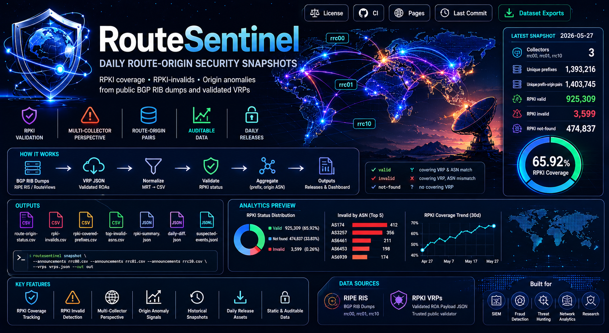
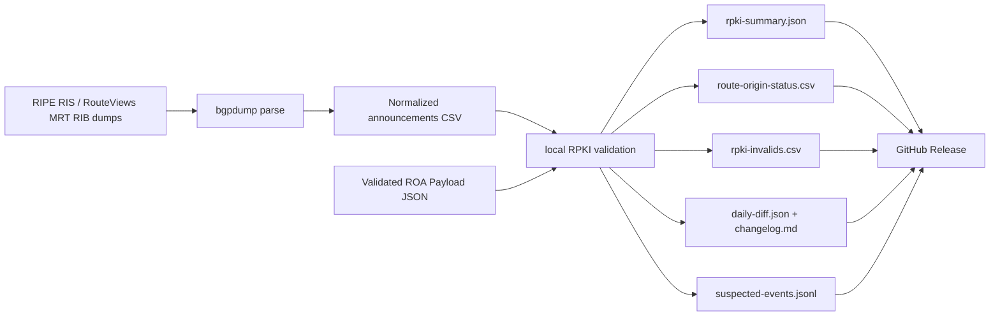

_English version: [README.md](README.md)_

# RouteSentinel

Ежедневные снимки безопасности происхождения маршрутов на основе публичных дампов BGP RIB и валидированных RPKI VRP.

RouteSentinel формирует пригодный для аудита набор данных по покрытию RPKI, объявлениям маршрутов со статусом RPKI-invalid и консервативным сигналам аномалий происхождения. Он спроектирован как пакетный конвейер: без сканирования интернета, без API-запросов для каждого префикса и без зависимости от потока в реальном времени для набора данных v1.

<p align="center">
  
</p>

Набор данных по умолчанию дедуплицируется до уникальных пар «маршрут-происхождение» `(prefix, origin ASN)` и фиксирует, какие коллекторы видели каждую пару. Благодаря этому ежедневные релизы отражают состояние «маршрут-происхождение», а не дублирующиеся строки видимости на уровне пиров.

## Последний снимок

<!-- routesentinel-stats:start -->
Последний успешный снимок: **2026-09-12**
Файлы релиза: [2026-09-12](https://github.com/ipanalytics/RouteSentinel/releases/tag/data-current)
Релиз обновлён: **2026-09-12 13:09 UTC**

| Метрика | Значение |
| --- | ---: |
| Коллекторы | rrc00, rrc01, rrc10 |
| Уникальные префиксы | 1,427,592 |
| Уникальные пары «префикс-происхождение» | 1,437,184 |
| RPKI valid | 1,027,973 |
| RPKI invalid | 3,398 |
| Уникальные невалидные префиксы | 3,388 |
| RPKI not-found | 405,813 |
| Доля покрытия RPKI | 71.53% |

_Этот блок обновляется после успешной публикации GitHub Release._
<!-- routesentinel-stats:end -->

## Что он создаёт

- `rpki-summary.json`: агрегированные счётчики и доля покрытия RPKI.
- `route-origin-status.csv`: нормализованный статус для каждой уникальной пары «префикс-происхождение».
- `rpki-invalids.csv`: пары «префикс-происхождение», покрытые ROA, но исходящие от неожиданного ASN.
- `rpki-covered-prefixes.csv`: префиксы, имеющие хотя бы один покрывающий ROA.
- `top-invalid-asns.csv`: ASN, ранжированные по количеству невалидных пар «префикс-происхождение».
- `daily-diff.json`: машиночитаемый diff относительно предыдущего релиза, если он доступен.
- `changelog.md`: человекочитаемый ежедневный diff и сводка по снимку.
- `suspected-events.jsonl`: консервативные сигналы событий, такие как `rpki-invalid`,
  `multi-origin` и `multi-origin-invalid`.
- Ежедневные файлы GitHub Release с тегами по дате.

## Как это работает



RouteSentinel сравнивает каждое объявление BGP с локальной таблицей VRP:

- `valid`: существует покрывающий VRP, и ASN происхождения совпадает.
- `invalid`: существует покрывающий VRP, но ASN происхождения не совпадает.
- `not-found`: покрывающий VRP отсутствует.

## Источники данных

RouteSentinel ожидает два типа источников:

- Дампы BGP RIB в формате MRT, например снимки RIPE RIS или RouteViews.
- Validated ROA Payload JSON, формируемый RPKI-валидатором или доверенным публичным источником VRP.

Входящий в комплект ежедневный workflow использует мультиколлекторный срез RIPE RIS: `rrc00`, `rrc01`
и `rrc10`. Это шире, чем один коллектор, но всё ещё взгляд на систему маршрутизации на основе
коллекторов. Чтобы расширить обзор до более глобального, добавьте в workflow коллекторы RouteViews,
такие как `route-views2` и `route-views6`, и передавайте их нормализованные CSV-файлы в
`routesentinel snapshot`.

В версии v1 проект сам не выполняет криптографическую валидацию RPKI. Он использует уже валидированные VRP и выполняет на их основе локальную проверку «маршрут-происхождение».

## Установка

Требования:

- Python 3.11+
- `bgpdump` для разбора MRT при использовании `routesentinel parse-mrt`

Установка для локальной разработки:

```bash
python -m pip install -e ".[dev]"
```

Запуск тестов:

```bash
python -m pytest
```

## Использование

Сборка снимка из нормализованных объявлений и JSON-файла VRP:

```bash
routesentinel snapshot \
  --announcements data/normalized/rrc00.csv \
  --announcements data/normalized/rrc01.csv \
  --vrps data/raw/vrps.json \
  --out out
```

CSV нормализованных объявлений:

```csv
prefix,origin_asn,as_path,peer,collector
203.0.113.0/24,64496,64497 64496,192.0.2.1,rrc00
```

VRP JSON:

```json
{
  "roas": [
    {
      "prefix": "203.0.113.0/24",
      "maxLength": 24,
      "asn": "AS64496"
    }
  ]
}
```

Скачивание исходных файлов с ответственным User-Agent:

```bash
routesentinel fetch \
  https://data.ris.ripe.net/rrc00/latest-bview.gz \
  data/raw/rrc00-latest-bview.gz
```

Преобразование дампа MRT в нормализованный CSV:

```bash
routesentinel parse-mrt \
  data/raw/rrc00-latest-bview.gz \
  data/normalized/rrc00.csv \
  --collector rrc00
```

`parse-mrt` по умолчанию выполняет дедупликацию по `(prefix, origin ASN, collector)`. Затем `snapshot` объединяет коллекторы в уникальные пары route-origin `(prefix, origin ASN)`. Используйте `--no-dedupe` только тогда, когда вам явно нужны строки с видимостью на уровне пиров (peer).

## Ежедневные релизы

Включённый в поставку workflow `.github/workflows/release.yml` запускается ежедневно в `06:00 UTC` и:

1. Устанавливает Python и `bgpdump`.
2. Скачивает RIB-дампы RIPE RIS и один публичный JSON-файл VRP.
3. Нормализует MRT-анонсы в дедуплицированные CSV-файлы.
4. Формирует сводку, статусы route-origin, невалидные записи, подозрительные события и топ невалидных ASN.
5. Скачивает состояние предыдущего релиза, если оно доступно.
6. Формирует ежедневный diff/changelog.
7. Публикует файлы как ассеты GitHub Release с тегами по дате.

Для более широкого покрытия добавьте больше коллекторов и передайте каждый нормализованный CSV как дополнительный параметр `--announcements`.

Долго выполняющиеся CLI-команды выводят прогресс в stderr. В логах GitHub Actions вы увидите сообщения вида:

```text
[routesentinel] download progress 250.0 MiB / 800.0 MiB (31.2%)
[routesentinel] parse progress bgpdump_lines=1000000 raw_announcements=999999 unique_announcements=120000 duplicates_skipped=879999
[routesentinel] aggregate progress rows_seen=1000000 unique_prefix_origin_pairs=120000
[routesentinel] validate progress rows_seen=1000000 unique_prefix_origin_pairs=120000 duplicates_collapsed=880000
```

## Схемы выходных данных

`rpki-summary.json`:

```json
{
  "coverage_ratio": 0.5,
  "invalid": 1,
  "not_found": 0,
  "total_announcements": 2,
  "unique_invalid_prefixes": 1,
  "unique_prefix_origin_pairs": 2,
  "unique_prefixes": 2,
  "valid": 1
}
```

`route-origin-status.csv`:

```csv
prefix,origin_asn,status,expected_origins,collectors
203.0.113.0/24,64496,valid,64496,rrc00 rrc01
198.51.100.0/24,64499,invalid,64500,rrc00
```

`rpki-invalids.csv`:

```csv
prefix,origin_asn,status,expected_origins,collectors
198.51.100.0/24,64499,invalid,64500,rrc00
```

`top-invalid-asns.csv`:

```csv
origin_asn,invalid_prefix_origin_pairs
64499,1
```

`daily-diff.json` отслеживает:

- новые RPKI-невалидные пары префикс-origin;
- устранённые RPKI-невалидные пары префикс-origin;
- новые origin ASN для префиксов;
- префиксы, впервые покрытые RPKI.

`suspected-events.jsonl`:

```jsonl
{"confidence":"medium","prefix":"198.51.100.0/24","seen_origins":[64499],"signal":"rpki-invalid"}
```

## Принципы проектирования

- Пакетная обработка в первую очередь (batch-first): ежедневные срезы перед потоковой обработкой в реальном времени.
- Учёт источников (source-aware): каждое событие сохраняет контекст коллектора и пира, когда он доступен.
- Консервативные метки: набор данных сообщает о сигналах, а не утверждает факт перехвата (hijack).
- Удобство для операторов: выходные данные компактны, стабильны и пригодны для GitHub Releases.

## Ограничения

- В v1 не реализована valley-free-валидация утечек маршрутов (route leak).
- В v1 не поддерживается приём потоков обновлений RIS Live или Kafka.
- Префиксы с несколькими origin могут быть легитимными, особенно при anycast и сложных схемах traffic engineering.
- Точность зависит от видимости коллекторов и свежести выбранного VRP-фида.

## Лицензия

MIT. См. [LICENSE](LICENSE).
